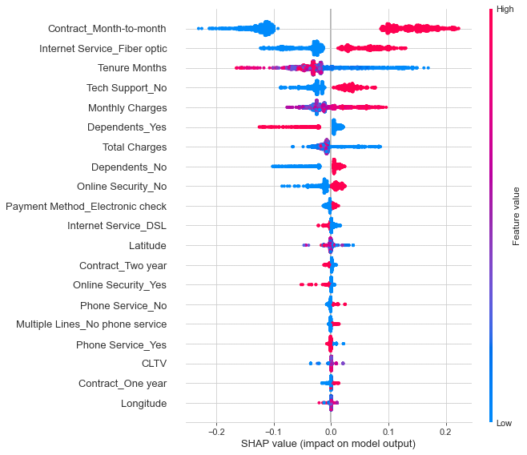

# Telco Project

### In this project, I try to understand the customer churn rate of a fictional telco company that provides home phone and Internet services to 7,043 customers in California in Q3 based on 33 features. This project is based on a Kaggle challenge (https://www.kaggle.com/blastchar/telco-customer-churn). This project was conducted independently during June 2021.

## Problem Description
I try to answer the following questions:
1. How to predict a customer's churn rate? What are the most important features that predict the churn rate?

## Data Description
The cross-sectional dataset contains 7,043 observations and 33 features. It contains whether the customer has left the company in the past month, the services that the customer

## Business Insights:
1. Month-to-Month Contract is bad for retaining customers.
2. The Telco company needs to improve its Fiber Optic Internet services.
3. Make technical support an default option can help retain customers.

## Exploratory Data Analysis
**Exploratory Data Analysis.ipynb**

  

